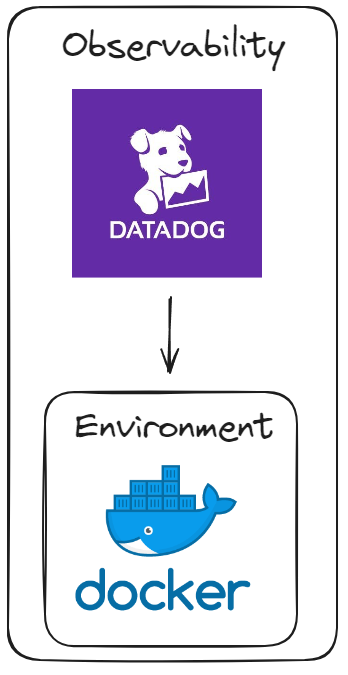
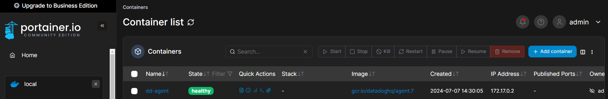
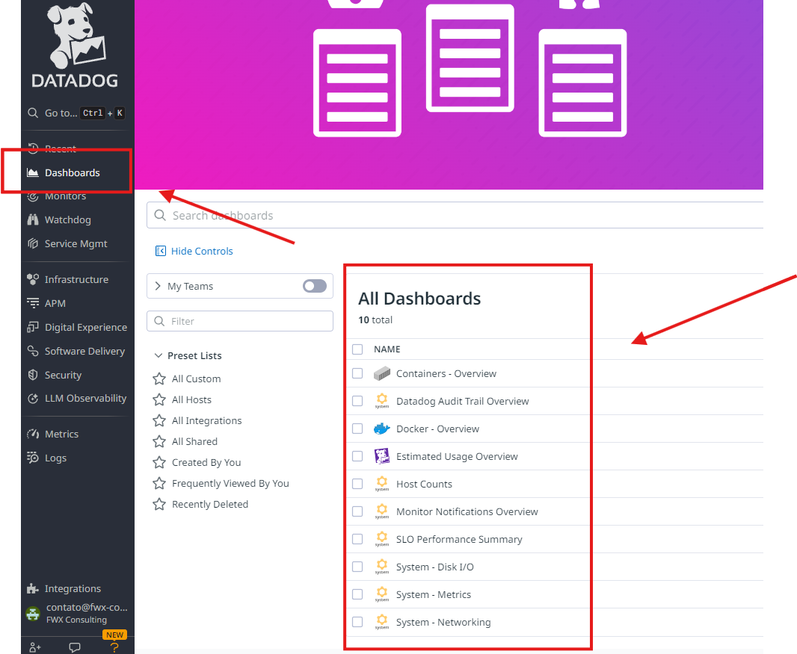
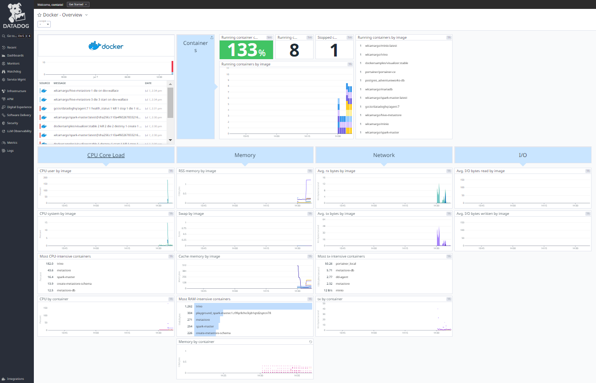

# Monitoring Environment Docker with Datadog

# Architecture


## Prerequisites
* Account on Datadog 
* Environment Docker

## How unlock prerequisites?
### Account on Datadog

https://www.datadoghq.com/pt/dg/monitor/free-trial/?utm_source=google&utm_medium=paid-search&utm_campaign=dg-brand-latam-pt-brand&utm_keyword=datadog&utm_matchtype=b&igaag=153297799639&igaat=&igacm=20597899603&igacr=675396948380&igakw=datadog&igamt=b&igant=g&utm_campaignid=20597899603&utm_adgroupid=153297799639&gad_source=1&gclid=Cj0KCQjw-ai0BhDPARIsAB6hmP4NOrAROyYSGordFpF857evBxlE-uu93nF4uvvO3UEDkwQ739pL0_kaAm-pEALw_wcB 

### Environment Docker
How install Docker? 

Tutorial: https://www.youtube.com/playlist?list=PLbPvnlmz6e_L_3Zw_fGtMcMY0eAOZnN-H


## Steps for use Datadog

* get your api key

### Run Container Datadog Agent
```
docker run -d --name dd-agent -e DD_API_KEY=<your-api-key> -e DD_SITE="datadoghq.eu" -v /var/run/docker.sock:/var/run/docker.sock:ro -v /proc/:/host/proc/:ro -v /sys/fs/cgroup/:/host/sys/fs/cgroup:ro -v /var/lib/docker/containers:/var/lib/docker/containers:ro gcr.io/datadoghq/agent:7
```

### Container running
sample:


### All Automated Dashboards
sample:


### Monitoring Server Docker
sample:


## References

https://docs.datadoghq.com/

## Developer
| Desenvolvedor      | LinkedIn                                   | Email                        | Portfólio                              |
|--------------------|--------------------------------------------|------------------------------|----------------------------------------|
| Wallace Camargo    | [LinkedIn](https://www.linkedin.com/in/wallace-camargo-35b615171/) | wallacecpdg@gmail.com        | [Portfólio](https://wlcamargo.github.io/)   |
